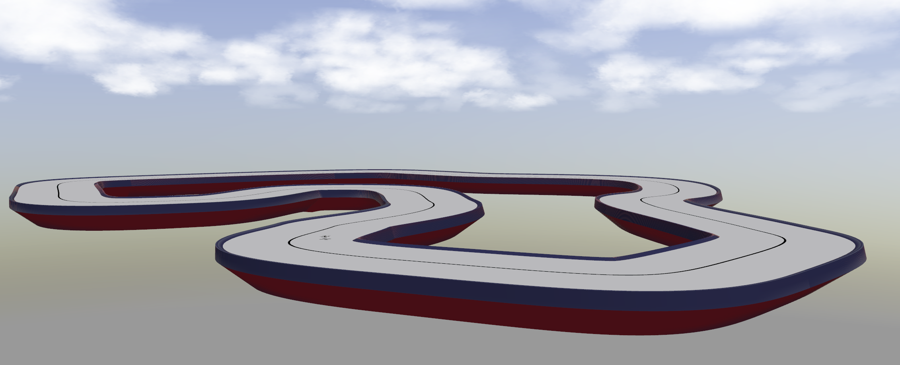
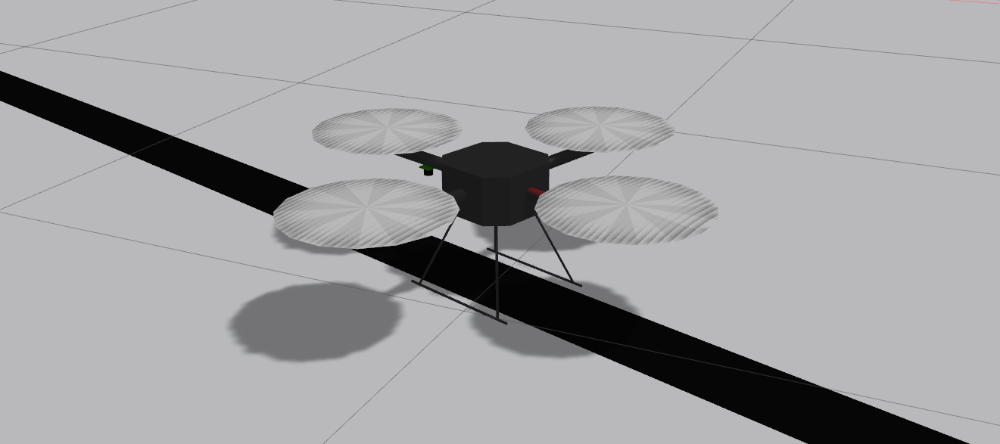

Репозиторий содержит программное обеспечение для
подготовки и сдачи задания категории _Бакалавриат_  направления Робототехники олимпиады [Я - Профессионал](https://yandex.ru/profi/courses2020).

Данное программное обеспечение, в исходном, предоставляемом участникам виде, будет использоваться для проведения оценки заданий участников.

Предоставялемое программное обеспечение включает:

* ROS-пакеты для симуляции квадрокоптера внутри симулятора gazebo.

* ROS-пакет *profi2021_bachelor_scene*, содержащий описание сцены для симулятора gazebo, а так же launch-файл для запуска обозначенной сцены c квадрокоптером в исходной позиции на ней.

Работа с пакетом предполагается из docker-контейнера, предоставляемого участникам в составе [основного репозитория олимпиады](https://gitlab.com/beerlab/iprofi2021/profi2021_robotics), соответственно, предоставляемые далее инструкции требуют предварительно выполнить инструкции, представленные в нем.

#### Установка программного обеспечения

1. В новом терминале **вне docker-контейнера** перейдите в корневую директорию основного репозитория олимпиады и склонируйте данный репозиторий в рабочее окружение выполнив:

        cd workspace/src
        git clone https://gitlab.com/beerlab/iprofi2021/profi2021_bachelor_scene.git

2. Откройте bash-сессию **внутри контейнера**, перейдите в смонтированное рабочее окружение и соберите все пакеты:

        bash docker/into_docker.sh
        cd /workspace
        catkin build

#### Описание программного обеспечения

1. Для запуска симулятора в новой bash-сессии **внутри контейнера** запустите соответствующий launch-файл:

        roslaunch profi2021_bachelor_scene start_scene.launch
        rosservice call /enable_motors "enable: true"

    После запуска симулятора на сцене будет создан квадрокоптер.

    

2. Для управления квадрокоптером доступен [топик */cmd_vel*](http://docs.ros.org/en/jade/api/geometry_msgs/html/msg/Twist.html). Для того, чтобы начать управлять квадрокоптером, требуется предварительно запустить двигатели воспользовавшись соответствующим сервисом:

        rosservice call /enable_motors "enable: true"

    После этого возможно управлять квадрокоптером, например, вручную, выполнив команду ниже и следуя инструкции предоставляемой в терминале:

        rosrun teleop_twist_keyboard teleop_twist_keyboard.py

    Изображение с бортовой камеры квадрокоптера доступно из соответствующего [топика */cam_1/camera/image*](https://docs.ros.org/en/melodic/api/sensor_msgs/html/msg/Image.html).

3. Для реализации решения, вам предоставлен репозиторий с шаблоном ros-пакета, доступный по [ссылке](https://gitlab.com/beerlab/iprofi2021/profi2021_bachelor_solution)
