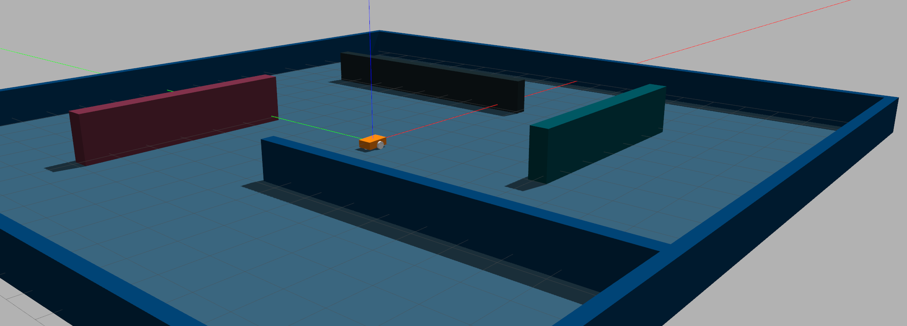

Репозиторий содержит программное обеспечение для подготовки к участию в олимпиаде [Я - Профессионал](https://yandex.ru/profi/courses2020) направления Робототехники.

Предоставялемое программное обеспечение включает ros-пакет в состав которого входят описание сцены и робота с дифференциальным типом привода и камерой для симулятора gazebo.

Работа с пакетом предполагается из docker-контейнера предоставляемого участникам в составе [основного репозитория олимпиады](https://gitlab.com/beerlab/iprofi2021/profi2021_robotics). Там же находятся инструкции по установке и начале работы с пакетом.
