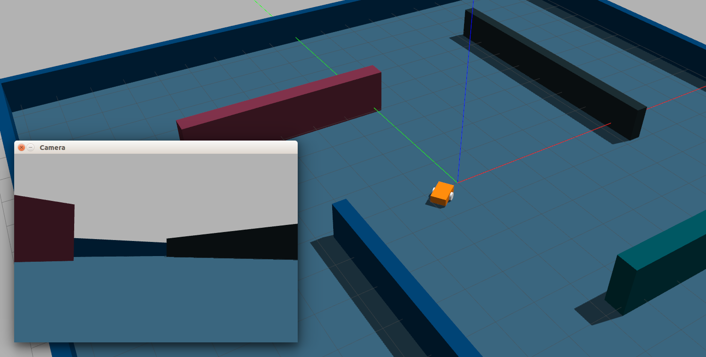
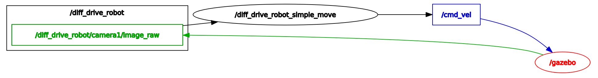

Репозиторий содержит программное обеспечение для подготовки к участию в олимпиаде [Я - Профессионал](https://yandex.ru/profi/courses2020) направления Робототехники.

Предоставялемое программное обеспечение включает ros-пакет в состав которого входит ros-узел для демонстрации взаимодействия с роботом в симуляторе gazebo.

Работа с пакетом предполагается из docker-контейнера предоставляемого участникам в составе [основного репозитория олимпиады](https://gitlab.com/beerlab/iprofi2021/profi2021_robotics). Там же находятся инструкции по установке и началу работы с пакетом.

#### Описание узла

Исходный код узла находится в *scripts/simple_move.py* [Python] и в *src/simple_move.cpp* [C++]. Узел подписывается на [топик с изображением](https://docs.ros.org/en/melodic/api/sensor_msgs/html/msg/Image.html) с камеры робота *image_raw* и публикует желаемую скорость робота в [топик *cmd_vel*](http://docs.ros.org/en/jade/api/geometry_msgs/html/msg/Twist.html). На рисунке ниже соответствующие топики и узлы представленны схематически.

